  <picture>
    <source media="(prefers-color-scheme: dark)" srcset="dark.svg">
    <source media="(prefers-color-scheme: light)" srcset="light.svg">
    
  </picture>

 

  <h1>Hi there, I'm Karri Gowtham Venkata Reddy 👋</h1>
  

 

  

    
    
    
  

  

    
    
    
  

 

<h2 align="center"><code>&gt; cat about_me.txt</code></h2>

  
Final-Year Computer Science Engineering student passionate about Software Development, Artificial Intelligence, Cloud Computing, and Problem Solving. Enjoys building scalable web applications and AI-powered solutions, and is continuously learning emerging technologies. Currently building an AI-based face-recognition attendance system (Anti-Gravity AI) and preparing for Software Development Engineer roles.

 

<h2 align="center"><code>&gt; ls -l /tech_stack/</code></h2>

  
<b>Programming Languages</b>

  
    
  
<b>Frontend Development</b>

  
    
  
<b>Backend & Database</b>

  
    
  
<b>Tools & Cloud</b>

  

 

<h2 align="center"><code>&gt; ./run_projects.sh</code></h2>

<table align="center" width="100%">
  <tr>
    <td width="50%" valign="top">
      <h3 align="center">Anti-Gravity AI</h3>
      
<i>AI-Powered Attendance Management System (Latest Capstone)</i>

      

        
        
        
        
        
        
      

      
Full-stack face-recognition-based smart attendance system with three roles — Student, Faculty, Super Admin — including secure authentication, facial registration, real-time attendance tracking, analytics, OTP verification, and PDF/Excel report generation.

      

        
        
      

    </td>
    <td width="50%" valign="top">
      <h3 align="center">AI E-Commerce Web App</h3>
      
<i>Intelligent Product Recommendation Engine</i>

      

        
        
        
        
      

      
Full-stack web app with an intelligent product recommendation engine, modular component architecture, and optimized performance for a personalized shopping experience.

      

          
        
        
      

    </td>
  </tr>
</table>

 

<h2 align="center"><code>&gt; tail -f experience.log</code></h2>

<table align="center" width="100%">
  <tr>
    <td width="50%" valign="top">
      <h3 align="center">Virtual RPA Developer Intern</h3>
      
<b>AICTE EduSkills | UiPath Academic Alliance</b> <i>Apr 2025 – Jun 2025</i>

      
Designed and developed automation workflows using UiPath; automated repetitive business processes; worked with variables, loops, conditions, exception handling, and selectors.

    </td>
    <td width="50%" valign="top">
      <h3 align="center">Business Analyst Virtual Intern</h3>
      
<b>AICTE EduSkills | Celonis</b> <i>Jul 2025 – Sep 2025</i>

      
Learned business process mining using Celonis EMS; analyzed event logs to discover, monitor, and optimize business processes; built KPI dashboards and reports.

    </td>
  </tr>
</table>

 

<h2 align="center"><code>&gt; cat research.md</code></h2>

  

    <b>Title:</b> AI-Integrated and Energy-Optimized Robotic Systems for Autonomous Water Surface Purification: A Comprehensive Survey 
    <b>Journal:</b> AISES Journal, 2025 — Peer Reviewed 
    <i>Tags: AI Integration, Intelligent Automation, Optimization Methodologies, Engineering Systems</i>
  

 

<h2 align="center"><code>&gt; ./verify_certifications.sh</code></h2>

  

    
    
    
    
  

 

<h2 align="center"><code>&gt; check_achievements</code></h2>

  

    
    
    
    
    
  

 

<h2 align="center"><code>&gt; ./github_analytics.sh</code></h2>

  
  
    
  

 

  

 

<h2 align="center"><code>&gt; ping connect.network</code></h2>

  

    
    
    
    
  

   

  
<b><i>"Code. Learn. Build. Repeat."</i></b>

  

